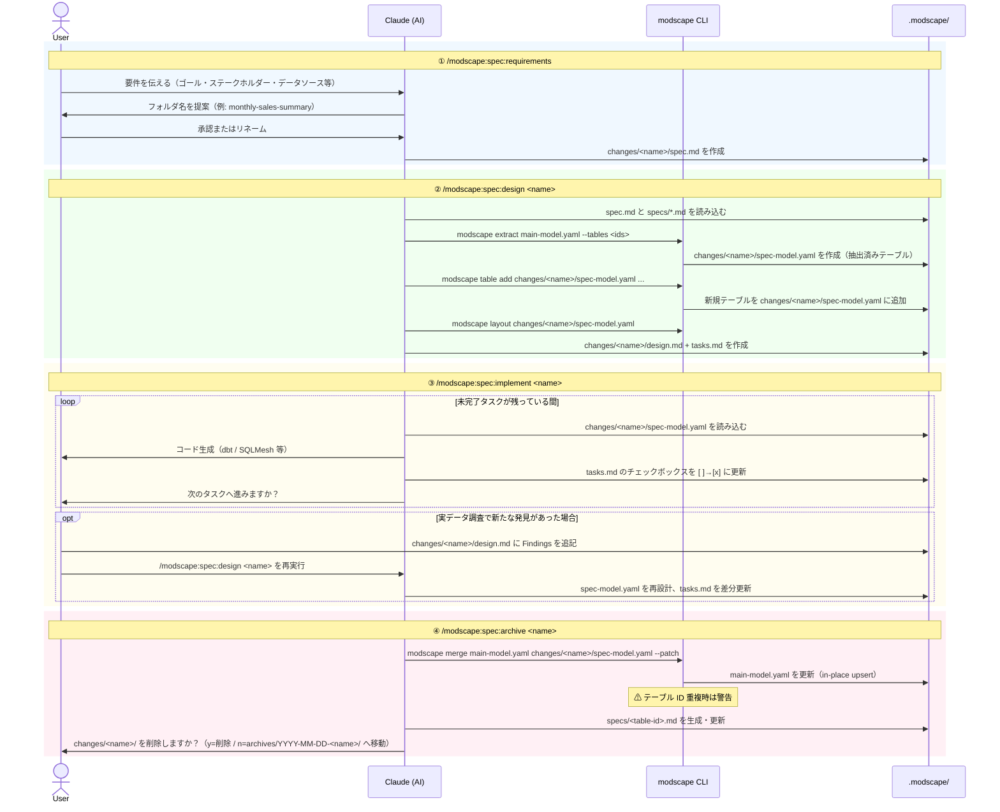

# modscape-sdd

[Modscape](https://github.com/yujikawa/modscape) を使った **Spec-Driven Data Engineering (SDD)** のサンプルリポジトリです。

[English version is here](README.md)

---

## SDD とは？

SDD は、データモデルに構造化されたワークフローを加え、ビジネス要件から実装・永続的なテーブルドキュメントまでを一貫して管理する手法です。各パイプラインは独自の名前付き作業フォルダで管理され、完了後はテーブル単位のビジネス仕様としてアーカイブされます。

---

## セットアップ

```bash
# Claude Code
modscape init --claude --sdd

# Codex
modscape init --codex --sdd

# Gemini CLI
modscape init --gemini --sdd

# すべてのエージェント
modscape init --all --sdd
```

スキルとカスタマイズテンプレートをインストールし、`.modscape/changes/` と `.modscape/specs/` ディレクトリを作成します。

---

## ワークフロー

### 1. 要件定義 — `/modscape:spec:requirements`

AI エージェントとの対話形式でパイプラインの仕様を整理します。

- AI が `modscape spec new <name>` で作業フォルダを生成
  - `spec-config.yaml`, `spec-model.yaml`, `design.md`, `tasks.md` を作成
- ゴール・ステークホルダー・データソース・受け入れ基準・対象ツールを収集
- `modscape-spec.custom.md` から `main-model.yaml` のパスを解決（なければプロンプトで確認）
- 出力: `.modscape/changes/<name>/spec.md`

### 2. モデル設計 — `/modscape:spec:design <name>`

- `spec.md` と既存の `specs/*.md` を読み込み、影響テーブルを自動特定
- `modscape extract` で `main-model.yaml` から関連テーブルを `changes/<name>/spec-model.yaml` に抽出
- `spec-config.yaml` に各テーブルが属する `main-model.yaml` を記録
- `design.md`（設計判断）と `tasks.md`（実装チェックリスト）を生成
- **再実行可能**: `design.md` の `### Requires Model Change` に追記して再実行するとモデルとタスクが更新される

### 3. 実装 — `/modscape:spec:implement <name>`

タスクを1件ずつこなしながら dbt / SQLMesh のコードを生成し、チェックボックスを更新します。

### 4. アーカイブ — `/modscape:spec:archive <name>`

永続的なテーブル仕様に同期し、作業フォルダを整理します。

- `spec-config.yaml` の設定に従い、`changes/<name>/spec-model.yaml` を対象の `main-model.yaml` にマージ
- 影響を受けた各テーブルの `.modscape/specs/<table-id>.md` を生成・更新
- 上流テーブルには Changelog エントリのみ追記
- 作業フォルダは自動的に `.modscape/archives/YYYY-MM-DD-<name>/` へ移動

> **Tip**: `/modscape:spec:status <name>` をいつでも実行して、現在のフェーズ・タスク進捗・次に推奨されるコマンドを確認できます。

> **カスタマイズ**: `.modscape/changes/modscape-spec.custom.md.example` を `modscape-spec.custom.md` にリネームすると、デフォルトのツールターゲット・必須フィールド・出力規則をプロジェクト単位で上書きできます。

---

## ワークフロー図



---

## サンドボックス環境

`sandbox/` ディレクトリに **Apache Spark + Apache Iceberg + Apache Airflow** の実行環境が含まれています。SDD で設計したパイプラインを実際に動かして確認できます。

### 構成

| サービス | 役割 | URL |
|---|---|---|
| Apache Airflow | パイプライン実行・スケジューリング | http://localhost:8080 |
| Apache Iceberg | Spark 上のテーブルフォーマット（MinIO に保存） | — |
| MinIO | S3 互換オブジェクトストレージ | http://localhost:9001 |
| Jupyter Notebook | インタラクティブな Spark SQL 探索 | http://localhost:8888 |

### 前提条件

**Linux / WSL2:**
```bash
curl -fsSL https://get.docker.com | sudo sh
sudo usermod -aG docker $USER
# 再ログイン後に有効
```

**macOS (Colima):**
```bash
brew install colima docker docker-compose
colima start --cpu 4 --memory 8 --disk 30
```

### 起動

```bash
cd sandbox
make up      # イメージビルド & 全サービス起動
make ps      # 状態確認（全サービスが Up になるまで待つ）
```

### パイプライン実行

```bash
make trigger     # annual_billing_pipeline DAG を実行
make query-arr   # mart_arr（ARR スナップショット）を確認
```

または Airflow UI（http://localhost:8080、admin / admin）から `annual_billing_pipeline` を手動トリガー。

> **初回実行時**: `seed_raw` タスクで PySpark が Maven から JAR を自動ダウンロードします（3〜5 分）。2 回目以降はキャッシュが効くため高速です。

### パイプラインの4フェーズ

```
seed_raw → stg_billing → core_vault → mart_arr
```

| フェーズ | Airflow タスク | 内容 |
|---|---|---|
| Phase 0 | `seed_raw` | `raw.billing_subscriptions` にサンプルデータを投入 |
| Phase 1 | `stg_billing` | `stg_billing__subscriptions`（ステージング） |
| Phase 2 | `core_vault` | `hub_subscription` / `sat_subscription_status` / `fct_subscription_events` |
| Phase 3 | `mart_arr` | `mart_arr`（grain: year × plan × country） |

`sat_subscription_status` の `billing_cycle`・`annual_price_usd` と `fct_subscription_events` の `arr_amount` は `annual-billing` チェンジの受け入れ条件に対応しています。

### 停止・削除

```bash
make down        # サービス停止（データは保持）
make clean       # コンテナ・ボリューム・イメージをすべて削除
```

---

## リポジトリ構成

```
modscape-sdd/
├── modscape.yaml              # メインデータモデル（SaaS サブスクリプション分析）
├── dim_dates.yaml             # インポート用コンフォームド日付ディメンション
├── .modscape/
│   ├── rules.md               # モデリング規約（modscape init で生成）
│   ├── changes/               # アクティブな作業フォルダ
│   │   └── <name>/
│   │       ├── spec.md        # 要件
│   │       ├── spec-model.yaml
│   │       ├── spec-config.yaml
│   │       ├── design.md
│   │       └── tasks.md
│   ├── specs/                 # テーブル単位の永続ドキュメント
│   │   └── <table-id>.md
│   └── archives/              # 完了した作業フォルダ
│       └── YYYY-MM-DD-<name>/
└── sandbox/                   # Spark + Iceberg + Airflow 実行環境
    ├── docker-compose.yml
    ├── Makefile
    ├── airflow/               # Airflow イメージ（Java + PySpark 入り）
    └── spark/
        ├── conf/              # Spark カタログ設定
        └── jobs/              # PySpark ジョブ（パイプライン実装）
```
