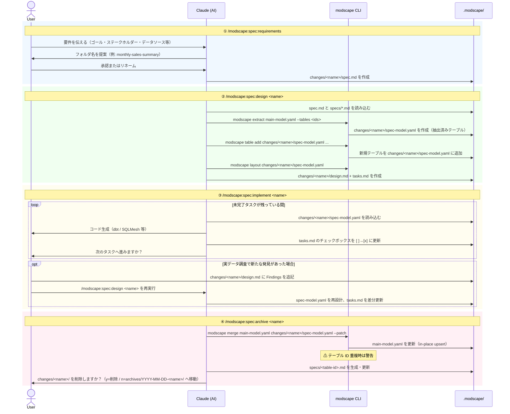

# modscape-sdd

[Modscape](https://github.com/yujikawa/modscape) を使った **Spec-Driven Data Engineering (SDD)** のサンプルリポジトリです。

[English version is here](README.md)

---

## SDD とは？

SDD は、データモデルに構造化されたワークフローを加え、ビジネス要件から実装・永続的なテーブルドキュメントまでを一貫して管理する手法です。各パイプラインは独自の名前付き作業フォルダで管理され、完了後はテーブル単位のビジネス仕様としてアーカイブされます。

---

## セットアップ

```bash
# Claude Code
modscape init --claude --sdd

# Codex
modscape init --codex --sdd

# Gemini CLI
modscape init --gemini --sdd

# すべてのエージェント
modscape init --all --sdd
```

スキルとカスタマイズテンプレートをインストールし、`.modscape/changes/` と `.modscape/specs/` ディレクトリを作成します。

---

## ワークフロー

### 1. 要件定義 — `/modscape:spec:requirements`

AI エージェントとの対話形式でパイプラインの仕様を整理します。

- AI が `modscape spec new <name>` で作業フォルダを生成
  - `spec-config.yaml`, `spec-model.yaml`, `design.md`, `tasks.md` を作成
- ゴール・ステークホルダー・データソース・受け入れ基準・対象ツールを収集
- `modscape-spec.custom.md` から `main-model.yaml` のパスを解決（なければプロンプトで確認）
- 出力: `.modscape/changes/<name>/spec.md`

### 2. モデル設計 — `/modscape:spec:design <name>`

- `spec.md` と既存の `specs/*.md` を読み込み、影響テーブルを自動特定
- `modscape extract` で `main-model.yaml` から関連テーブルを `changes/<name>/spec-model.yaml` に抽出
- `spec-config.yaml` に各テーブルが属する `main-model.yaml` を記録
- `design.md`（設計判断）と `tasks.md`（実装チェックリスト）を生成
- **再実行可能**: `design.md` の `### Requires Model Change` に追記して再実行するとモデルとタスクが更新される

### 3. 実装 — `/modscape:spec:implement <name>`

タスクを1件ずつこなしながら dbt / SQLMesh のコードを生成し、チェックボックスを更新します。

### 4. アーカイブ — `/modscape:spec:archive <name>`

永続的なテーブル仕様に同期し、作業フォルダを整理します。

- `spec-config.yaml` の設定に従い、`changes/<name>/spec-model.yaml` を対象の `main-model.yaml` にマージ
- 影響を受けた各テーブルの `.modscape/specs/<table-id>.md` を生成・更新
- 上流テーブルには Changelog エントリのみ追記
- 作業フォルダは自動的に `.modscape/archives/YYYY-MM-DD-<name>/` へ移動

> **Tip**: `/modscape:spec:status <name>` をいつでも実行して、現在のフェーズ・タスク進捗・次に推奨されるコマンドを確認できます。

> **カスタマイズ**: `.modscape/changes/modscape-spec.custom.md.example` を `modscape-spec.custom.md` にリネームすると、デフォルトのツールターゲット・必須フィールド・出力規則をプロジェクト単位で上書きできます。

---

## ワークフロー図



---

## リポジトリ構成

```
modscape-sdd/
├── modscape.yaml              # メインデータモデル（SaaS サブスクリプション分析）
├── dim_dates.yaml             # インポート用コンフォームド日付ディメンション
├── .modscape/
│   ├── rules.md               # モデリング規約（modscape init で生成）
│   ├── changes/               # アクティブな作業フォルダ
│   │   └── <name>/
│   │       ├── spec.md        # 要件
│   │       ├── spec-model.yaml
│   │       ├── spec-config.yaml
│   │       ├── design.md
│   │       └── tasks.md
│   ├── specs/                 # テーブル単位の永続ドキュメント
│   │   └── <table-id>.md
│   └── archives/              # 完了した作業フォルダ
│       └── YYYY-MM-DD-<name>/
```
