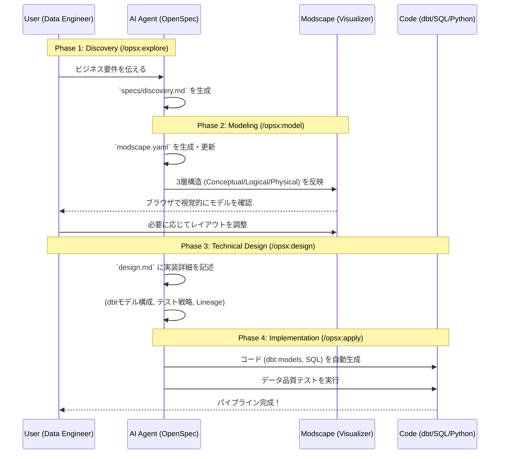

# Modscape SDD (Spec-Driven Data Engineering)

Modscape と OpenSpec を統合した、**スペック駆動型データエンジニアリング (SDDE)** のためのリポジトリです。
データの「ビジネス要件」「論理モデル」「物理設計」を分離し、AI と人間が協力して堅牢なデータパイプラインを構築します。

[English version is here](README.md)

## 🚀 コンセプト: Spec-Driven Data Engineering (SDDE)

従来のアドホックなデータ開発ではなく、**「スペック（設計図）」を唯一の真実 (Source of Truth)** とし、そこから実装を導き出すワークフローを採用しています。



## 🛠 導入方法 (Setup)

このワークフローを自身のプロジェクトに導入するには、以下のファイルをコピーするだけです。

1.  **OpenSpec 設定のコピー**:
    - `openspec/schemas/data-platform.yaml`
    - `openspec/config.yaml`
2.  **Modscape の初期化**:
    ```bash
    npx modscape init
    ```
    これにより、モデリング規約である `.modscape/rules.md` が生成されます。

## 📋 ワークフローの詳細

### 1. Discovery (`/opsx:explore`)
「何のために」「どんなデータを」作るのかを整理します。ビジネス定義やデータソースの特定を行います。

### 2. Modeling (`/opsx:model`)
`modscape.yaml` を作成または更新します。
- **Conceptual**: `appearance.type` (fact, dimension, hub, sat 等) を定義。
- **Logical**: カラム名、型、PK/FK を定義（ビジネス的な Source of Truth）。
- **Physical**: 実際のデータベース上のテーブル名や制約を定義。

### 3. Technical Design (`/opsx:design`)
モデリングした構造を、具体的にどのツール（dbt, Snowflake, Airflow 等）でどう実装するかを設計します。

### 4. Implementation (`/opsx:apply`)
設計に基づき、`proposal.md` と `tasks.md` を経て、実際のコードを生成・実装します。

---
Produced by [Gemini CLI](https://github.com/google/gemini-cli) & [OpenSpec](https://openspec.dev)
