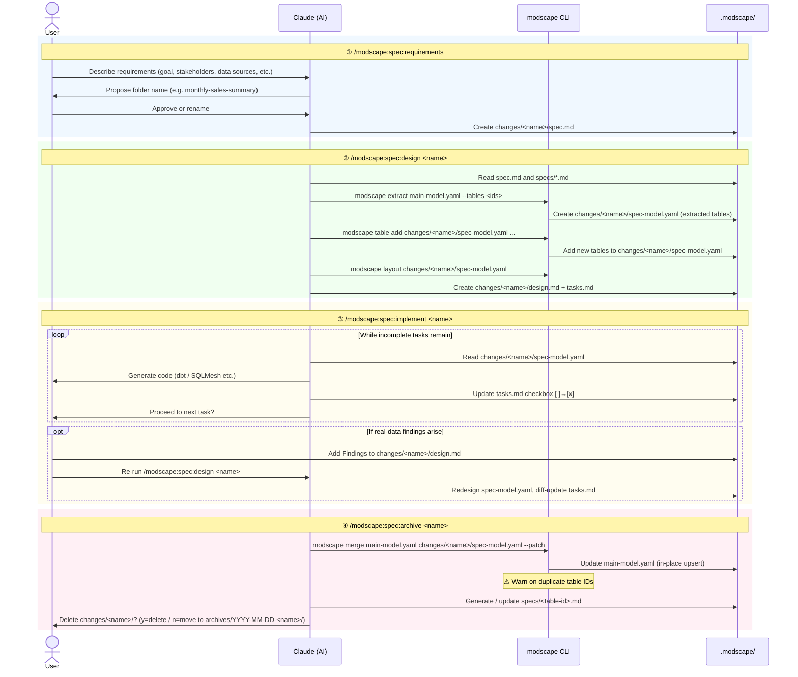

# modscape-sdd

A sample repository for **Spec-Driven Data Engineering (SDD)** using [Modscape](https://github.com/yujikawa/modscape).

[日本語版はこちら (Japanese version)](README.ja.md)

---

## What is SDD?

SDD adds a structured workflow on top of your data model, guiding you from business requirements through implementation to permanent, per-table documentation. Each pipeline is managed in its own named work folder and archived as table-level business specs when complete.

---

## Setup

```bash
# Claude Code
modscape init --claude --sdd

# Codex
modscape init --codex --sdd

# Gemini CLI
modscape init --gemini --sdd

# All agents
modscape init --all --sdd
```

Installs skills and a customization template. Creates `.modscape/changes/` and `.modscape/specs/` directories.

---

## Workflow

### 1. Define requirements — `/modscape:spec:requirements`

Interactively capture the pipeline spec with your AI agent.

- AI scaffolds the work folder via `modscape spec new <name>`
  - Creates `spec-config.yaml`, `spec-model.yaml`, `design.md`, `tasks.md`
- Collects goal, stakeholders, data sources, acceptance criteria, and target tool
- Resolves `main-model.yaml` path from `modscape-spec.custom.md` or prompts the user
- Output: `.modscape/changes/<name>/spec.md`

### 2. Design the model — `/modscape:spec:design <name>`

- Reads `spec.md` and existing `specs/*.md` to auto-identify affected tables
- Runs `modscape extract` to pull relevant tables from `main-model.yaml` into `changes/<name>/spec-model.yaml`
- Records which tables belong to `main-model.yaml` in `spec-config.yaml`
- Generates `design.md` (design decisions) and `tasks.md` (implementation checklist)
- **Re-runnable**: add findings under `### Requires Model Change` in `design.md`, re-run to update model and tasks

### 3. Implement — `/modscape:spec:implement <name>`

Work through tasks one by one, generating dbt / SQLMesh code and updating checkboxes.

### 4. Archive — `/modscape:spec:archive <name>`

Sync permanent table specs and clean up the work folder.

- Merges `changes/<name>/spec-model.yaml` into the correct `main-model.yaml` per `spec-config.yaml`
- Generates / updates `.modscape/specs/<table-id>.md` for each affected table
- Upstream tables receive a Changelog entry only
- Work folder is automatically moved to `.modscape/archives/YYYY-MM-DD-<name>/`

> **Tip**: Run `/modscape:spec:status <name>` at any time to check the current phase, task progress, and the next recommended command.

> **Customization**: Rename `.modscape/changes/modscape-spec.custom.md.example` to `modscape-spec.custom.md` to override default tool targets, required fields, and output conventions per project.

---

## Workflow Diagram



---

## Sandbox Environment

The `sandbox/` directory contains a ready-to-run **Apache Spark + Apache Iceberg + Apache Airflow** environment. Use it to execute and validate the pipelines you design through the SDD workflow.

### Services

| Service | Role | URL |
|---|---|---|
| Apache Airflow | Pipeline execution & scheduling | http://localhost:8080 |
| Apache Iceberg | Table format on top of Spark (stored in MinIO) | — |
| MinIO | S3-compatible object storage | http://localhost:9001 |
| Jupyter Notebook | Interactive Spark SQL exploration | http://localhost:8888 |

### Prerequisites

**Linux / WSL2:**
```bash
curl -fsSL https://get.docker.com | sudo sh
sudo usermod -aG docker $USER
# Re-login to apply group change
```

**macOS (Colima):**
```bash
brew install colima docker docker-compose
colima start --cpu 4 --memory 8 --disk 30
```

### Start

```bash
cd sandbox
make up      # Build images & start all services
make ps      # Check status (wait until all services show Up)
```

### Run the Pipeline

```bash
make trigger     # Trigger the annual_billing_pipeline DAG
make query-arr   # Query mart_arr (ARR snapshot result)
```

Or trigger `annual_billing_pipeline` manually from the Airflow UI (http://localhost:8080, admin / admin).

> **First run**: The `seed_raw` task downloads PySpark JARs from Maven automatically (~3–5 min). Subsequent runs use the cache and are much faster.

### Pipeline Phases

```
seed_raw → stg_billing → core_vault → mart_arr
```

| Phase | Airflow Task | Description |
|---|---|---|
| Phase 0 | `seed_raw` | Load sample data into `raw.billing_subscriptions` |
| Phase 1 | `stg_billing` | Create `stg_billing__subscriptions` (staging) |
| Phase 2 | `core_vault` | Build `hub_subscription` / `sat_subscription_status` / `fct_subscription_events` |
| Phase 3 | `mart_arr` | Build `mart_arr` (grain: year × plan × country) |

The `billing_cycle` and `annual_price_usd` columns in `sat_subscription_status`, and `arr_amount` in `fct_subscription_events`, satisfy the acceptance criteria of the `annual-billing` SDD change.

### Stop / Clean Up

```bash
make down        # Stop services (data is preserved)
make clean       # Remove all containers, volumes, and local images
```

---

## Repository Structure

```
modscape-sdd/
├── modscape.yaml              # Main data model (SaaS subscription analytics)
├── dim_dates.yaml             # Imported conformed date dimension
├── .modscape/
│   ├── rules.md               # Modeling conventions (generated by modscape init)
│   ├── changes/               # Active work folders
│   │   └── <name>/
│   │       ├── spec.md        # Requirements
│   │       ├── spec-model.yaml
│   │       ├── spec-config.yaml
│   │       ├── design.md
│   │       └── tasks.md
│   ├── specs/                 # Permanent per-table documentation
│   │   └── <table-id>.md
│   └── archives/              # Completed work folders
│       └── YYYY-MM-DD-<name>/
└── sandbox/                   # Spark + Iceberg + Airflow execution environment
    ├── docker-compose.yml
    ├── Makefile
    ├── airflow/               # Airflow image (with Java + PySpark)
    └── spark/
        ├── conf/              # Spark catalog configuration
        └── jobs/              # PySpark jobs (pipeline implementation)
```
