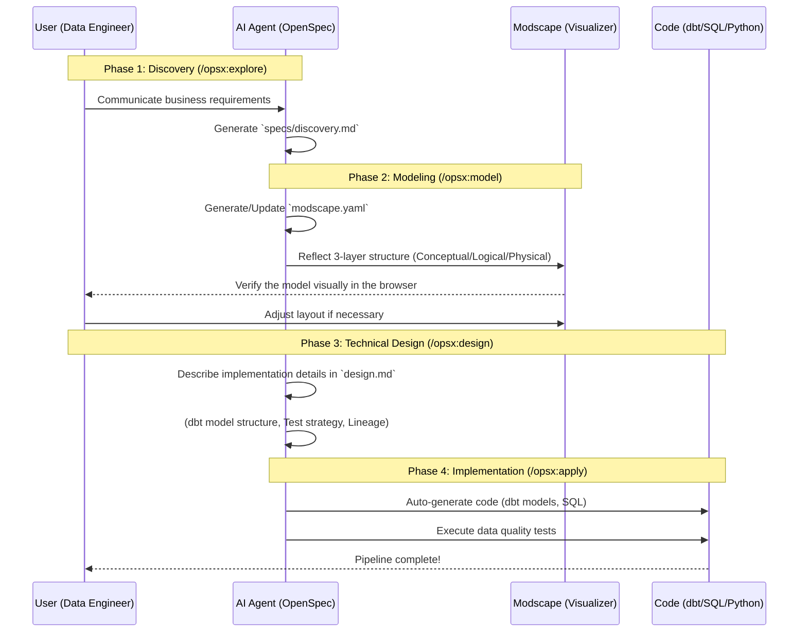

# Modscape SDD (Spec-Driven Data Engineering)

This repository is for **Spec-Driven Data Engineering (SDDE)**, integrating Modscape and OpenSpec.
It separates "Business Requirements," "Logical Models," and "Physical Design" to build robust data pipelines through collaboration between AI and humans.

[日本語版はこちら (Japanese version)](README.ja.md)

## 🚀 Concept: Spec-Driven Data Engineering (SDDE)

Instead of traditional ad-hoc data development, we use the **"Spec" as the single Source of Truth (SoT)** to derive implementations.



## 🛠 Setup

To introduce this workflow into your project, simply copy the following files:

1.  **Copy OpenSpec configuration**:
    - `openspec/schemas/data-platform.yaml`
    - `openspec/config.yaml`
2.  **Initialize Modscape**:
    ```bash
    npx modscape init
    ```
    This generates `.modscape/rules.md`, which defines the modeling conventions.

## 📋 Workflow Details

### 1. Discovery (`/opsx:explore`)
Clarify "Why" and "What" data needs to be created. Identify business definitions and data sources.

### 2. Modeling (`/opsx:model`)
Create or update `modscape.yaml`.
- **Conceptual**: Define `appearance.type` (fact, dimension, hub, sat, etc.).
- **Logical**: Define column names, types, PK/FK (Business Source of Truth).
- **Physical**: Define actual database table names and constraints.

### 3. Technical Design (`/opsx:design`)
Design how the modeled structure will be implemented using specific tools (dbt, Snowflake, Airflow, etc.).

### 4. Implementation (`/opsx:apply`)
Based on the design, generate and implement the actual code via `proposal.md` and `tasks.md`.

---
Produced by [Gemini CLI](https://github.com/google/gemini-cli) & [OpenSpec](https://openspec.dev)
